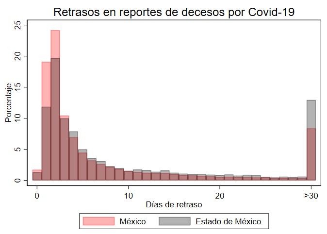
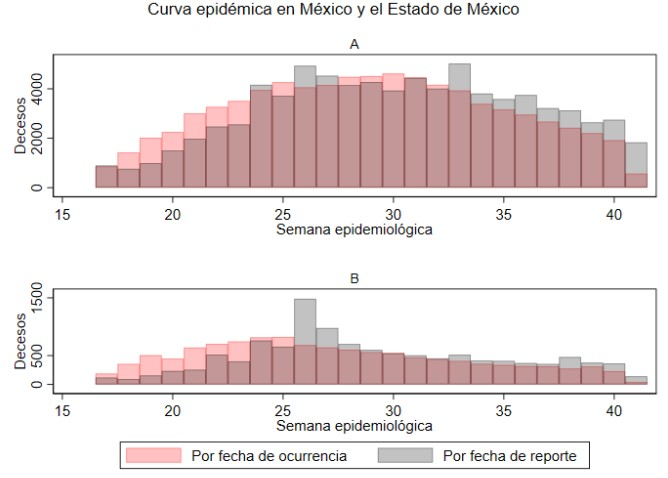
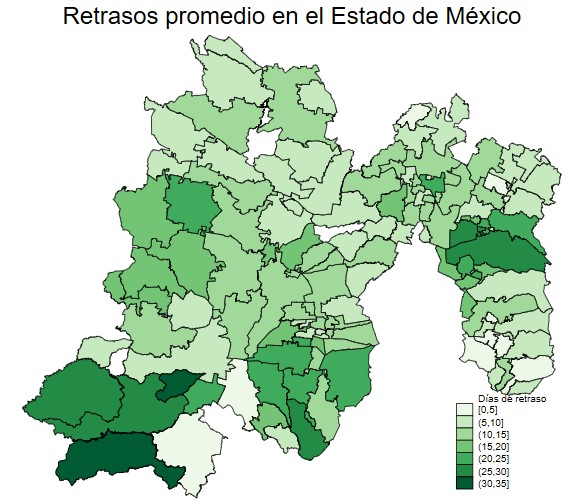
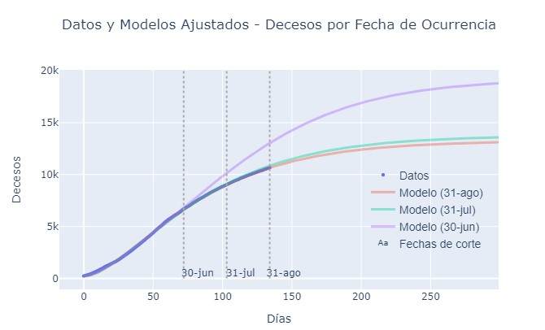

# covid_edomex
Analysis of delays in death reports due to Covid-19 in the State of Mexico

Project for the Applied Research class at ITAM, taught by Emilio Fernández and Tiago Tavares in the fall semester of 2020.

#### Data
The figures for cases and deaths published by the Secretariat of Public Health are used. In these data, the date of death may not be defined if the patient is still alive or if the death has not been reported. For this reason, it is possible to identify the days of delay in the reports by comparing the information reported on different days.

#### Software
The analysis is carried out with Stata, except for the estimates of the evolution of the pandemic with the SIR model, which were done in Python.

#### Files:

* retrasos_edomex: final document
* img/ Main results.
* dofiles/01_descriptive_stats: Descriptive statistics of cases and deaths in the State of Mexico compared to the rest of the country.
* dofiles/02_descriptive_maps: Descriptive maps of mortality rates, fatality rates, and cumulative cases and deaths by State and by municipality of the State of Mexico.
* dofiles/03_fecha_reporte_decesos: Calculation of the delay days in death reports using all the databases reported by the SSP from April to October.
* dofiles/04_histograma: Histograms of delay days in death reports due to COVID-19 in Mexico and the State of Mexico.
* dofiles/05_mapa_delays: Maps with delays by municipality.
* dofiles/06_evolution_deaths: Comparison of epidemiological curves according to deaths by date of occurrence and date of report.
* dofiles/07_SIR_estimation: Generate a database with deaths by date of occurrence and by date of report per day to calibrate the SIR model.
* simulaciones_f: Simulation of epidemic curves (parameter calibration was previously done).
* data/deaths_sir: Resulting file from the do file 07_SIR_estimation.

#### Highlights

